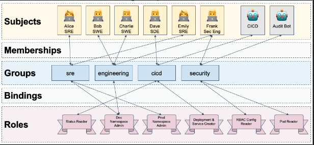

Today, Kubecon EU 2020 has started as an online event because of the pandemic so I’m starting a series of posts summarizing the most important topics covered. Hopefully, you found this helpful.

I'm starting with the presentation called [ Help! My Cluster Is On The Internet: Container Security Fundamentals](https://kccnceu20.sched.com/event/ZetO/help-my-cluster-is-on-the-internet-container-security-fundamentals-samuel-davidson-google) by Samuel Davidson from Google.

There are 4 areas where we can improve our security related to Kubernetes. These areas are Containers, Pods, Cluster and User.

- Containers
  - #1 - Assume you will be owned:
    - Always new vulnerabilities will be found. That's inevitable because of the complexity of every software. So it's better to be prepared all the time to mitigate this risk working with best security practices.
  - #2 - Use a distroless base image:
    - Distroless images are bare-bones versions of common base images. They have the bare-minimum needed to execute a binary. So if an attacker gains access, it's not possible to do a lot of damage.
    - When you are interested to reduce size, Alpine should be your choice. For security, the choice should be distroless. Both are very reduced size and implementing security by the concept of **Less attack surface** by avoiding unnecessary stuff on the packaged docker images but distroless has no a package manager at all.
    -  You can check Google's GitHub repository of distroless docker images in the following [link](https://github.com/GoogleContainerTools/distroless)
  - #3 - Containers should be easy to rebuild and redeploy:
    - It'd be an automated process by a CI/CD pipeline. Having full automation should be the goal. It can work even as a **disaster recovery strategy** because you can rebuild your entire infrastructure from zero quickly.
  - #4 - Trust your containers with signatures:
    - Your CI/CD platform should sign the containers it builds for production and the image repository is trusted through TLS.
    - Think about the possibility that one attacker pushed an infected version of your code in the container registry.
    - So, a container with a not valid signature is not accepted in the cluster. It's not implemented natively by Kubernetes, but it can be done with a **policy engine** like [Gatekeeper](https://github.com/open-policy-agent/gatekeeper)

- Pods
  - #1 - Don't use hostPath:
    - Avoid using the Node’s filesystem. It can be edited for other pods, apps, etc.
    - There are better alternatives like _PersistentVolumeClaim_.
  - #2 - Don't use _hostNetwork_
    - Binds the pod to the Node’s network. Allows localhost communication with K8s infrastructure components running on the node.
  - #3 - Be conscious of your pod's Service Account
    - **All pods** have a service account by default even if you don’t set one in the _podSpec_.
    - Then, the credentials for your pods service account are automatically mounted within its filesystem and available to the container which can be owned by an attacker !!
  - #4 Avoid privileged containers in your pods:
    ```yaml
    spec:
      containers:
      - image: klaudioz/hello-world
        name: hello-world
        securityContext:
          privileged: true
    ```
      - This pod is owned by _root_, so if an attacker owns the pod, it can be very dangerous.

- Cluster
  - #1 - Keep your cluster up to date:
    - Bugs and vulnerabilities are fixed all the time, also Kubernetes provides a secure incremental way to update the nodes of the cluster one by one.
  - #2 - Isolate your cluster from the Internet:
    - Your nodes should not be on the internet with a publicly addressable IP. Use a _LoadBalancer_ for that.
  - #3 - For your secrets use secrets
    - Great for access keys, passwords, tokens, etc. Stored in memory, never saved to a node.
    - The security of Secrets comes from _RBAC_ and using many namespaces as security boundaries.
  - #4 Don’t use basic auth:
    -  It is a quick convenient way to set up usernames and passwords with your API Server using the flag:	`--basic-auth-file=...`
    -  **NEVER** use it in a production cluster.

- User
  - #1 - All your devs and robots (CICD, automation) should have a unique identity:
    - Every person or service account should have a unique identity to interact with the cluster.
  - #2 - Use _RBAC_ and groups
    -  Implement the [Principle of Least Privilege](https://en.wikipedia.org/wiki/Principle_of_least_privilege) in your cluster with RBAC’s fine-grained controls in an easy way.
 -  #3 - Using RBAC, bind policies against groups not individuals.
    -  Use _Roles_ and _Bindings_ within the cluster:
    -  
  - #4 - Use a policy agent to protect your cluster
    - Typically a Kubernetes [AdmissionController](https://kubernetes.io/docs/reference/access-authn-authz/admission-controllers/) which selectively allows/denies Kubernetes resource requests based on rules (or policies)
    - It can be used Gatekeeper. It's very easy to configure and make it works.