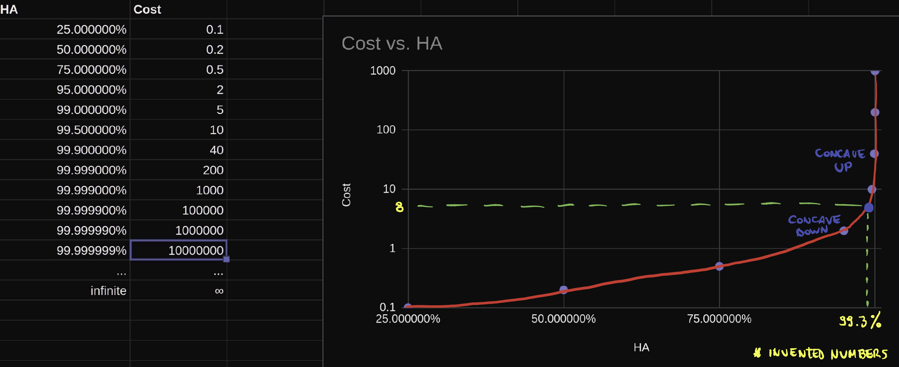

Quick answer: **Yes**, high availability is not about being a hundred percent available. It's about being close to that. Actually, the word is **high** availability. It's not total availability or full availability.

A hundred percent uptime with no failures and with no humans involved is an utopia, and not just that. It’s also a wrong goal because the nature of http prevents you from always being a 100% HA (High availability). The chances that not a single request will ever be lost are impossible for a system with an important number of activity.

It’s not just a technical or money challenge, it’s a human issue, and as humans we will fail. It involves everything and anything can fail any moment. We can plan and implement very reliable architectures, but get a 100% HA is an infinite resources issue. I think we can understand easily this phenomenon with an exponential function graph like:

I’ve put some invented figures which are giving a good idea about what you’ll see in the graph. Basically, a 100% HA will have an infinite cost. It’s the nature of exponential numbers. Even having an infinite budget for implementing this extremely complex architecture, it’s needed also a 100% HA of your internet, electric sources and another invisible system for a common user like [Cloudflare](https://blog.cloudflare.com/cloudflare-outage-on-july-17-2020/), cloud availability zones or regions, etc.

Seeing the graph, my recommendation is to find the **inflection point** between the costs and availability. We can calculate it with the **second derivative** of the graph.

Another important question is: Maybe right now is impossible to get 100% HA but what about in the future?. It’s very to predict anything, specially in this industry where the knowledge is changing so fast. The only constant is the change and complexity going up so, in my opinion, it’ll be very difficult for me to see this utopia as a reality, during my lifetime 😬